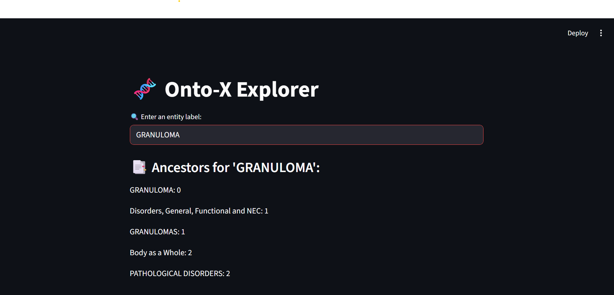
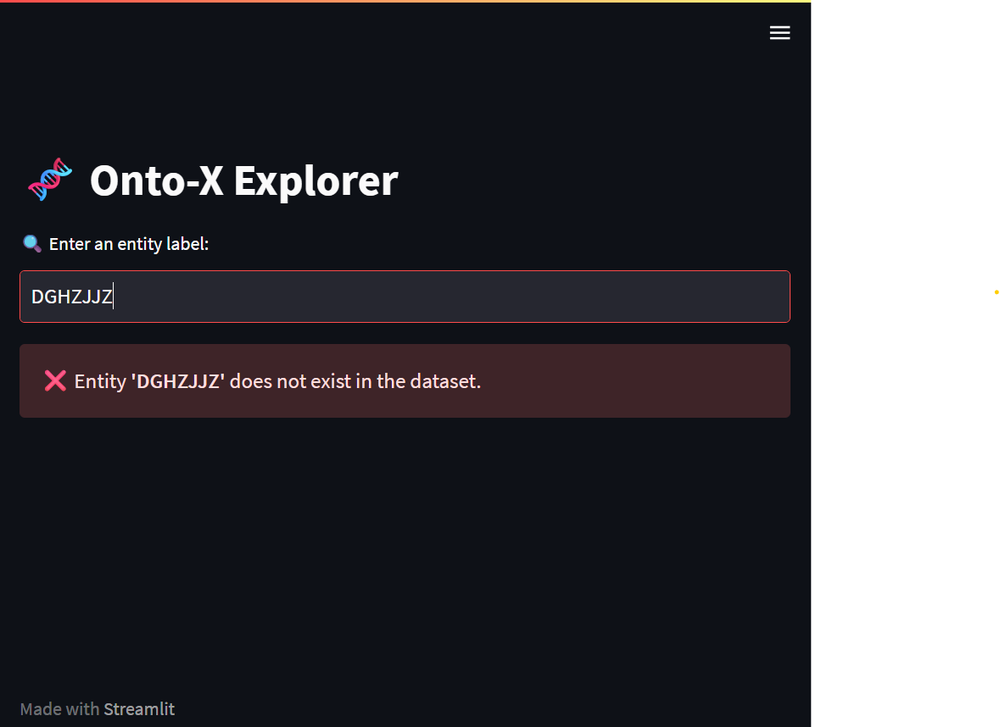

🧬 Onto-X Explorer

A Streamlit-based ontology explorer that allows users to browse entities, their parents, and full ancestor trees.
It loads an ontology (from onto_x.csv) and allows users to search entities, explore their parents, and retrieve the full ancestor hierarchy.

✅ For End-Users → Interactive interface to query entities and understand relationships

⚙️ For IT/Engineers → Explorring the exceptions related to the ontology dataset

🚀 Features

Load ontology from CSV (onto_x.csv)
Search by label
Visualize ancestor hierarchy
Automatic handling of common data issues
Web interface with Streamlit

▶️ Usage

1. Install dependencies
   pip install -r requirements.txt
2. Run the app
   streamlit run onto_x.py
   Then open 👉 http://localhost:8501

## 🛡️ Exception Handling Guide

Below are common **data issues** and how the system handles them:

| ⚠️ Problem              | 📄 Description                  | 🛠️ Handling / Fix                                 |
| ----------------------- | ------------------------------- | ------------------------------------------------- |
| ❌ **Empty Label**      | Preferred Label missing         | Skip row or assign placeholder (e.g. `"UNKNOWN"`) |
| 🌀 **Duplicate Labels** | Same label maps to multiple IDs | Keep first, log warning                           |
| 🆔 **Empty Class ID**   | Missing unique identifier       | Discard row                                       |
| 🆔❌ **Duplicate IDs**  | Same ID defined multiple times  | Keep last, log overwrite                          |
| 🌱 **No Parents**       | Orphan nodes (roots)            | Valid, but flagged                                |
| 🔄 **Cycle Detected**   | Entity is ancestor of itself    | Halt loading, log error                           |
| 🔗 **Missing Parent**   | Parent ID not found in dataset  | Log warning, ignore parent                        |
| 🔍 **Label Not Found**  | User query doesn’t exist        | Show Streamlit error box                          |

---

## 🌳 Ancestor Extraction

One of the core features of Onto-X Explorer is **ancestor extraction**.  
When a user enters an entity label, the system:

1. Looks up the entity’s unique `Class ID`
2. Uses **Breadth-First Search (BFS)** to traverse upwards through its parents
3. Collects all ancestors and their depth (distance from the queried entity)

### 🔎 Why BFS?

- ⚡ **Faster on shallow trees** – BFS explores parents level by level, so closer ancestors are found quickly.
- 🛡️ **Cycle Protection** – A visited-set ensures the search never loops infinitely, even if cycles exist in the dataset.
- 🌳 **Accurate Depth Calculation** – BFS naturally keeps track of “distance” (how many steps from the queried entity).

### Example

If you query **“GRANULOMA”**, the explorer return:  
📸 Example Screenshot:  

If you query **"WRONG label"**, the explorer return:  
📸 Example Screenshot:  

